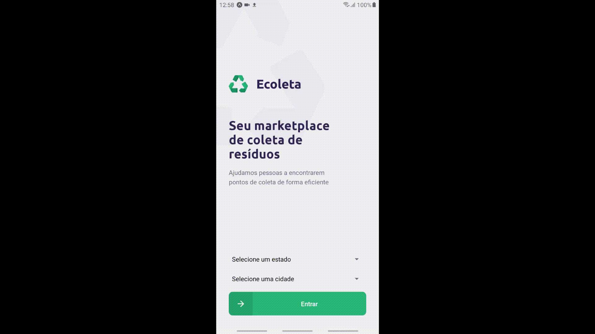

<h1 align="center">
 
  
 
 
Ecoleta
</h1>

Tem um ponto de coleta ou deseja verificar onde seria o melhor descarte para seu lixo? Esse app é para você!

[//]: # "Add your gifs/images here:"

  
  

## Tecnologias

[//]: # "Add the features of your project here:"

Essa aplicação usa as tecnologias mais atuais do mercado.

- ⚛️ **React Js** — Uma biblioteca JavaScript para criar interfaces de usuário
- ⚛️ **React Native** — Uma biblioteca JavaScript que permite criar aplicativos nativod para Android e iOS
- 💹 **Node Js** — Uma biblioteca que executa javascript fora do navegador
- :diamond_shape_with_a_dot_inside:

## Getting started

Describe here the way to use/install your project
